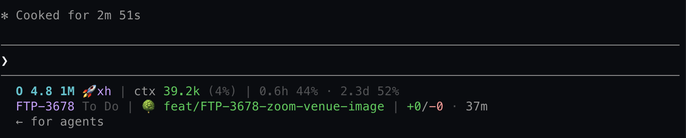

# claude-code-statusline (Go)

A compact status line for [Claude Code](https://code.claude.com), rewritten in Go. Single static binary, stdlib-only, no runtime dependencies. Beyond the original Python version it pulls in **the GitLab merge request** and **the Asana task** you're working on.

```
O 4.8 1M 🚀xh | 🌿 test/e2e-screenshot-toolkit-miniapp | FTP-3853 Backlog | MR!1297 ✓ | ctx 78.0k (7%) | +194/-77 · 1h9m | 1.5h 22% · 2.7d 41%
```

In a terminal too narrow for one line it wraps the task, branch, and session onto a second row instead of truncating (see [Narrow terminals](#narrow-terminals)).

## What it shows

| Segment | Example | Notes |
|---|---|---|
| Model + effort | `O 4.8 1M 🚀xh` | `Opus 4.8 (1M context)` → `O 4.8 1M`; effort gets a per-level glyph + abbr: `🌱lo` · `⚡med` · `🔥hi` · `🚀xh` · `💥max` |
| Git | `🌿 main*` | `*` = uncommitted changes; detached HEAD shown as `@abc1234` |
| Worktree | `🌳 agent-1 ← main` | 🌳 = linked worktree; `← main` = source branch in `--worktree` sessions |
| Multi-repo | `🌿 afisha:dev* · 🌳 cmux:agent-1` | one entry per repo when dirs are added via `/add-dir` |
| **Asana task** | `FTP-3853 Backlog` | the ticket id + board column of the task being worked on; `✓` prefix when completed; falls back to a truncated task name when there's no ticket id |
| **GitLab MR** | `MR!1297 ✓` | the open MR whose source branch is the current branch; `📝` draft · `✓`/`✗`/`●` pipeline passed/failed/running · `❗` conflicts · `💬` unresolved discussions |
| GitHub PR | `PR#12 👀` | ✅ approved · ❌ changes requested · 📝 draft · 👀 pending (from Claude Code's own `pr` field) |
| Context | `ctx 92.0k (9%)` | absolute tokens first; green <80k, yellow 80–100k, red >100k; ⚠ above 200k |
| Session | `+194/-77 · 1h9m` | lines added/removed, session duration |
| Rate limits | `1.5h 22% · 2.7d 41%` | time until the 5-hour / 7-day window resets + used %; yellow ≥70%, red ≥90% (Pro/Max only) |

Segments with no data are skipped — no empty placeholders.

## Narrow terminals

The status line normally renders on a single row. When that row would be wider than the terminal, the **task, branch, and session** segments drop to a **second row** (task before the branch name) so a long branch never gets truncated in a narrow window:

```
O 4.8 1M 🚀xh | ctx 70.0k (7%)
FTP-3678 To Do | 🌳 feat/FTP-3678-zoom-venue-image | +0/-0 · 0m
```



The width comes from the `COLUMNS` environment variable, which Claude Code sets to the current terminal size before each invocation (**requires Claude Code ≥ 2.1.153**). When `COLUMNS` is unset the line is never split. Wide terminals are unaffected — everything stays on one row.

> **Resize and `refreshInterval`.** Claude Code re-runs the status line on events (new message, `/compact`, mode change) and on the `refreshInterval` timer — but **not** on terminal resize. So after you resize the window the new width is only picked up on the next of those. Set a short `refreshInterval` (e.g. `2`) if you want the wrap to track resizing closely; the foreground render is local-only and cheap, so a low interval is fine.

## How the MR and Asana segments work (non-blocking)

A status line is re-run constantly, so it must never block on the network. This binary keeps the foreground render **local-only** (git + a small cache file) and refreshes the remote data out of band:

1. **Render** reads a cache keyed by `(repo, branch)` under `~/.cache/cc-statusline/` and prints instantly.
2. When the cache is older than 90s (or missing) it spawns a detached `--refresh` subprocess and returns immediately — the new data appears on the next render.
3. **`--refresh`** fetches the MR (via `glab`) and the Asana task (via the Asana REST API) concurrently, then writes the cache atomically. A non-blocking file lock collapses concurrent refreshes.

The very first render in a new branch shows no MR/Asana segment; they appear a second later once the background refresh lands.

## Install

Requires Go 1.23+, `git`, and (for the MR segment) the [`glab`](https://gitlab.com/gitlab-org/cli) CLI authenticated to your GitLab host.

```bash
git clone https://github.com/ggkguelensan/claude-code-statusline-go
cd claude-code-statusline-go
go build -o ~/.local/bin/claude-code-statusline .
```

Add to `~/.claude/settings.json` (the `command` may use `~`):

```json
{
  "statusLine": {
    "type": "command",
    "command": "~/.local/bin/claude-code-statusline",
    "refreshInterval": 60
  }
}
```

`refreshInterval` keeps the rate-limit countdown, the dirty indicator, and the background MR/Asana refresh ticking while the session is idle.

## GitLab MR

The MR is found automatically: `glab` resolves the host and project from the repo's `origin` remote and the binary queries the open MR whose `source_branch` is your current branch. No per-repo configuration — just make sure `glab auth status` is green for your host:

```bash
glab auth login --hostname gitlab.frhc.one
```

## Asana task

The standalone binary can't use Claude's Asana integration, so it talks to the Asana REST API with a [personal access token](https://developers.asana.com/docs/personal-access-token). The token is read **only** from the environment and sent **only** as an `Authorization: Bearer` header over HTTPS to `app.asana.com` — it is never logged, printed, or written to the cache (see [Security & privacy](#security--privacy)).

```bash
export ASANA_ACCESS_TOKEN=2/12345…/67890…:abcdef…   # in your shell profile
```

> **Keep the token out of your dotfiles.** On macOS, store it in the Keychain and export it at shell start:
> ```bash
> security add-generic-password -a "$USER" -s asana-pat -w '<your-token>'
> # in ~/.zshrc:
> command -v security >/dev/null && \
>   export ASANA_ACCESS_TOKEN="$(security find-generic-password -a "$USER" -s asana-pat -w 2>/dev/null)"
> ```

Without a token the Asana segment is simply skipped. With one, the task being worked on is resolved in this order:

1. **Explicit task** — `git config statusline.asana-task <gid>` (per-repo / per-worktree), or `$ASANA_TASK_GID`.
2. **Ticket id** — `git config statusline.ftp FTP-3853`, or the first `FTP-####` match in the branch name — looked up via the FTP custom field.

### Worked example (FTP-3853 / afisha !1297)

The branch `test/e2e-screenshot-toolkit-miniapp` carries no ticket id, so pin the task once in that worktree:

```bash
cd .../afisha            # on branch test/e2e-screenshot-toolkit-miniapp
git config statusline.asana-task 1215433767838047   # or: git config statusline.ftp FTP-3853
```

The MR (`!1297`) needs no config — it's detected from the branch. Result:

```
… | 🌿 test/e2e-screenshot-toolkit-miniapp | FTP-3853 Backlog | MR!1297 ✓ | …
```

### Asana config (env, with Ticketon defaults)

| Var | Default | Meaning |
|---|---|---|
| `ASANA_ACCESS_TOKEN` (`ASANA_TOKEN`, `ASANA_PAT`) | — | personal access token; required for the segment |
| `ASANA_WORKSPACE_GID` | `1208507351529750` | workspace searched for the ticket id |
| `ASANA_FTP_FIELD_GID` | `1211799464714835` | the "FTP" custom field used for ticket lookup |
| `ASANA_TICKET_PREFIX` | `FTP` | ticket prefix for branch-name extraction and the field name |

## Security & privacy

- **The Asana token never leaves the process except as a request header.** It is read from the environment, sent as `Authorization: Bearer …` over TLS to `app.asana.com`, and is never written to stdout/stderr, the cache, error messages, or a child process's arguments. The HTTP client that carries the token refuses to follow redirects, so the header can never be replayed to another host. The optional `CCSL_DEBUG` diagnostics log only GitLab API paths and error text — never the token.
- **`git`/`glab` run with the token stripped from their environment.** The status line runs `git` inside whatever directory you're in — including freshly cloned, untrusted repos. So `git` and `glab` are invoked with the Asana token removed from their environment, and `git` additionally runs with `core.fsmonitor` and `core.hooksPath` disabled — a hostile repo's local config can neither execute code with the secret present nor read the token out of git's environment.
- **No shell is ever invoked.** `git` and `glab` are run with an explicit argument vector (`exec.Command`), so branch names, paths, and git-config values cannot be shell-interpreted.
- **The cache holds only non-secret data** (MR/Asana titles, ticket ids, board columns) under `~/.cache/cc-statusline/`, keyed by a SHA-256 of `(repo, branch)`, written atomically and with user-only permissions (dir `0700`, files `0600`).
- **stdlib only** — no third-party dependencies, so there is no transitive supply-chain surface (`go.mod` lists none).

## Test without Claude Code

```bash
echo '{"model":{"display_name":"Opus 4.8 (1M context)"},"effort":{"level":"xhigh"},"workspace":{"current_dir":"."},"context_window":{"used_percentage":7,"context_window_size":1000000},"cost":{"total_cost_usd":2.17,"total_lines_added":194,"total_lines_removed":77,"total_duration_ms":4140000}}' | claude-code-statusline
```

Force the narrow-terminal layout by setting `COLUMNS`:

```bash
COLUMNS=60 claude-code-statusline < status.json
```

Warm the cache manually for a given checkout (what the background refresh does):

```bash
claude-code-statusline --refresh --dir /path/to/repo --branch my-branch
```

Run the tests:

```bash
go test ./...
```

## Customizing

Each segment is a `seg*` function in `render.go` / `gitlab.go` / `asana.go`. The one-line vs. two-line layout lives in `assemble()` (`render.go`); reorder or drop the entries in `render()` (`main.go`) freely. ANSI colors live in `color.go`; column-width measurement (ANSI- and emoji-aware) in `width.go`.

## License

[MIT](LICENSE)
